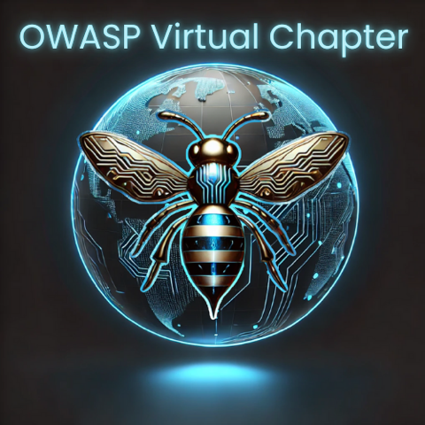

---

layout: col-sidebar
title: OWASP Virtual Chapter
tags: 
region: Virtual
country: 
meetup-group: OWASP-virtual-chapter

---

## Welcome

Welcome to the OWASP Virtual Chapter home page!

The OWASP Virtual Chapter invites everyone in the community to join our weekly meetings to hear from some of the brightest cybersecurity professionals. 

## Next and Upcoming Meetings
**Wedensday, January 21 12PM/EST** Zoom Link: To follow shortly

_MCP and the AI Security Cross Roads_ with guest speaker: Matt Tesauro

The rapid integration of Large Language Models (LLMs) into enterprise applications presents a new risk frontier for security professionals. While powerful, these integrations—especially those using third-party models—can create significant blind spots in data governance and security architecture. This session provides a practical framework for security architects and developers to navigate these challenges.

We will dissect protocols like the Model Context Protocol (MCP) to demonstrate how "frictionless" interoperability shifts the entire security burden onto the implementing organization. Moving beyond theory, this talk will introduce a robust strategy founded on three core principles: Visibility into data flows, Customization of security controls, and Control over AI interactions. Attendees will leave with actionable techniques to ensure their AI integrations are built on a foundation of security, not just convenience.

**Wednesday, February 18 12PM/EST** Zoom Link: To follow shortly

_44 Years to Clear Your Backlog: The Math That Doesn't Add Up_ with guest speaker: Bruce Fram

Your vulnerability backlog isn't shrinking—it's growing, and the math is brutal. At typical enterprise fix rates, you'll clear your backlog sometime around 2069, assuming AI hackers don't find everything first. Meanwhile, developers are "vibe coding" with AI assistants that introduce security issues in 24.7% of generated code, making the problem worse. Join Bruce Fram for a look at why manual remediation can't scale and how to implement an automated code fix program that dramatically drives down the cost of the $5,000+ enterprises spend to fix a single vulnerability. Attendees will receive a free copy of Bruce’s new book, “The AI Security Advantage”. Bruce was the founding CEO of Contrast Security and is the CEO of AppSecAI.

**Wednesday, March 18 12PM/EST** Zoom Link: To follow shortly

_AI Changed the Threat Model: Rethinking Application Security in 2026_ with guest speaker: Caroline Wong

AI is reshaping how applications are built—and how they’re attacked. From AI-assisted vulnerability discovery to automated exploitation and prompt injection risks, traditional AppSec assumptions no longer hold. This session examines how AI is accelerating both offensive and defensive capabilities, where organizations are most exposed today, and how security teams can adapt their application security strategies to keep pace with rapidly evolving threats.

**Wednesday, April 15 12PM/EST** Zoom Link: To follow shortly

With guest speaker: Chris Arciaga

More details will be available shortly. 

For all upcoming meetings, please visit and join our community on [Meet-Up](https://www.meetup.com/owasp-virtual-chapter/)

## Interested in Speaking or Sponsoring?
Please reach out to the [OWASP Virtual Chapter Leaders](mailto:virtual-chapter-leaders@owasp.org) for more details.

## Join our Slack Channel
Join our Virtual Chapter Slack Channel at #chapter-virtual

## Participation
The Open Worldwide Application Security Project (OWASP) is a nonprofit foundation that works to improve the security of software. All of our projects, tools, documents, forums, and chapters are free and open to anyone interested in improving application security. 

Chapters are led by local leaders in accordance with the [Chapters Policy](/www-policy/operational/chapters). Financial contributions should only be made online using the authorized online donation button. 

Everyone is welcome and encouraged to participate in our [Projects](/projects/), [Local Chapters](/chapters/), [Events](/events/), [Online Groups](https://groups.google.com/a/owasp.com/), and [Community Slack Channel](https://owasp.slack.com/). We especially encourage diversity in all our initiatives. OWASP is a fantastic place to learn about application security, to network, and even to build your reputation as an expert. We also encourage you to be [become a member](/membership/) or consider a [donation](/donate/) to support our ongoing work.

